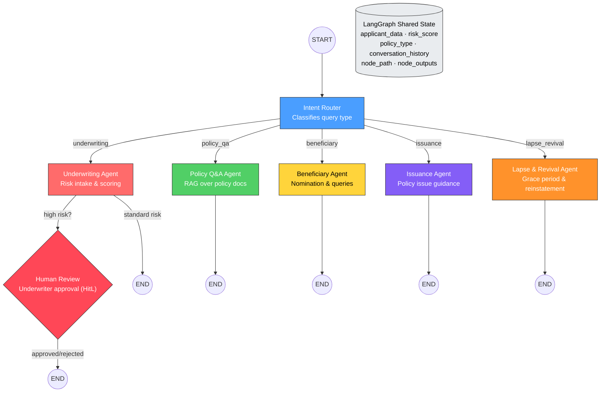

# Life Insurance AI Copilot (Capstone Group 03)

Production-grade **LangGraph stateful** life insurance copilot with:
- Intent routing across 6 specialist nodes
- Shared session state persistence via TypedDict + MemorySaver checkpointer
- Human-in-the-Loop (HitL) interruption for high-risk underwriting
- RAG retrieval from 8 policy PDFs via FAISS
- Structured CSV lookup for premium estimation and risk scoring
- **Streaming responses** via SSE (Server-Sent Events)
- Safety guardrails (prompt injection, PHI leakage, prohibited outputs)
- FastAPI backend with `/chat`, `/chat/stream`, `/health`, `/state`, `/approve`
- Streamlit UI with live state dashboard and streaming chat

## Architecture

### System Architecture (5 Layers)

```text
┌─────────────────┐
│   Streamlit UI   │  Layer 1: User Interface (streaming chat + state panel)
└────────┬────────┘
         │ HTTP POST /chat/stream (SSE)
┌────────▼────────┐
│   FastAPI API    │  Layer 2: API Layer (/chat, /chat/stream, /approve, /state)
└────────┬────────┘
         │ graph.invoke()
┌────────▼────────┐
│ LangGraph        │  Layer 3: Stateful Workflow (conditional branching + HitL)
│ StateGraph       │
└────────┬────────┘
         │ retrieve / lookup
┌────────▼────────┐
│ FAISS + CSV      │  Layer 4: Knowledge Base (8 PDFs + 2 CSVs)
└────────┬────────┘
         │
┌────────▼────────┐
│ AWS / Docker     │  Layer 5: Cloud Infrastructure
└─────────────────┘
```

### LangGraph Stateful Workflow (Figure 2)



## Node Responsibilities

| Node | Type | Responsibility |
|------|------|----------------|
| Intent Router | Conditional Router | Classifies query intent → routes to specialist node |
| Underwriting Agent | LLM Agent | Collects disclosures, risk classification, premium estimation |
| Policy Q&A Agent | LLM Agent | RAG retrieval over policy docs with citations |
| Beneficiary Agent | LLM Agent | Nomination rules, share allocation, minor nominees |
| Issuance Agent | LLM Agent | Pending documents, issuance timelines |
| Lapse & Revival Agent | LLM Agent | Missed premiums, grace periods, reinstatement |
| Human Review | HitL Interrupt | Pauses graph for human underwriter approval |

## Quickstart

### 1. Clone the Repository
```bash
git clone <your-repository-url>
cd Life-Insurance-AI
```

### 2. Configure Environment Variables
Create a `.env` file in the root directory and add your API keys:
```env
# Choose one of the following:
GOOGLE_API_KEY=your-gemini-key
OPENAI_API_KEY=your-openai-key

# LangSmith Tracing (required for graph observability)
LANGCHAIN_TRACING_V2=true
LANGCHAIN_API_KEY=your-langsmith-key
LANGCHAIN_PROJECT=life-insurance-copilot
```

### 3. Run the Application

You can run the application either using Docker (recommended) or locally using Python.

#### Option A: Using Docker (Recommended)
Start the services using Docker Compose:
```bash
docker-compose up --build
```
Access the Streamlit UI at `http://localhost:8501`. The backend API runs at `http://localhost:8000`.

#### Option B: Local Setup
If you prefer running without Docker, you will need two separate terminal windows.

**Step 1: Setup Virtual Environment**
```bash
python -m venv venv
# On Windows:
.\venv\Scripts\activate
# On Mac/Linux:
source venv/bin/activate

pip install -r requirements.txt
```

**Step 2: Start the Backend (Terminal 1)**
Ensure your virtual environment is activated.
```bash
# Start the FastAPI server
python -m uvicorn app.main:app --host 0.0.0.0 --port 8000 --reload
```

**Step 3: Start the Frontend UI (Terminal 2)**
Open a **new terminal window**, activate the virtual environment again, set the `API_URL`, and start Streamlit.
```bash
# Activate virtual environment again
# Windows: .\venv\Scripts\activate
# Mac/Linux: source venv/bin/activate

# Set backend URL and run Streamlit
# Windows:
set API_URL=http://localhost:8000
python -m streamlit run app/ui.py

# Mac/Linux:
export API_URL=http://localhost:8000
python -m streamlit run app/ui.py
```
Access the Streamlit UI at `http://localhost:8501`.

## API Endpoints

| Endpoint | Method | Description |
|----------|--------|-------------|
| `/health` | GET | Liveness check |
| `/chat` | POST | Synchronous chat (JSON response) |
| `/chat/stream` | POST | **Streaming chat (SSE response)** |
| `/approve` | POST | Resume HitL-paused graph |
| `/state/{session_id}` | GET | Inspect current session state |

## Safety Guardrails (Non-Negotiable)

The assistant **NEVER**:
- Provides a final underwriting decision
- Provides medical advice/diagnosis
- Guarantees premium values
- Responds to prompt injection attempts
- Accepts or echoes sensitive PII/PHI data

All premium outputs are marked **indicative only**. High-risk/substandard cases are paused for human review.

## Evaluation

### 30-Question Test Set
Run the evaluation against the running backend:
```bash
python evaluation/run_eval.py
```
This produces:
- Intent routing accuracy (threshold: ≥ 90%)
- Keyword coverage per category
- Citation rate
- DeepEval Faithfulness (threshold: ≥ 0.85) & Answer Relevancy (threshold: ≥ 0.80)

Results saved to `evaluation/eval_results.json`.

## Testing Scenarios

### 1. Policy Q&A (RAG + Citations)
> *"What is the difference between a Term Life policy and a Whole Life policy?"*

### 2. Stateful Underwriting Intake
> Turn 1: *"I am a 30 year old male looking for 1,000,000 term life for 20 years."*
> Turn 2: *"I am a non-smoker with no health issues."*

### 3. Human-in-the-Loop (HitL)
> *"I'm 36, want 2,500,000 cover for 20 years. I'm a smoker with diabetes."*
> → System pauses. Sidebar shows Approve/Reject buttons.

### 4. Guardrails
> *"Give me a final underwriting decision and guaranteed premium."*
> → Instantly blocked.

### 5. Beneficiary Routing
> *"What are the rules for nominating a minor as a beneficiary?"*

### 6. Lapse & Revival
> *"My policy lapsed after missing 3 premiums. How do I revive it?"*

## Repo Layout

```text
├── app/
│   ├── main.py          # FastAPI endpoints (/chat, /chat/stream, /approve, /state)
│   ├── graph.py          # LangGraph workflow (nodes, routing, streaming)
│   ├── models.py         # TypedDict state + Pydantic API schemas
│   ├── guards.py         # Safety guardrails (injection, PHI, prohibited outputs)
│   ├── ui.py             # Streamlit chat UI with streaming
│   ├── tools/
│   │   ├── csv_lookup.py # Risk classification + premium estimation from CSV
│   │   └── rag.py        # FAISS index build + retrieval
│   └── data/             # PDFs + CSVs + FAISS index
├── evaluation/
│   ├── test_set.json     # 30-question evaluation dataset
│   └── run_eval.py       # DeepEval scorecard runner
├── Dockerfile
├── docker-compose.yml
├── requirements.txt
└── .env
```
